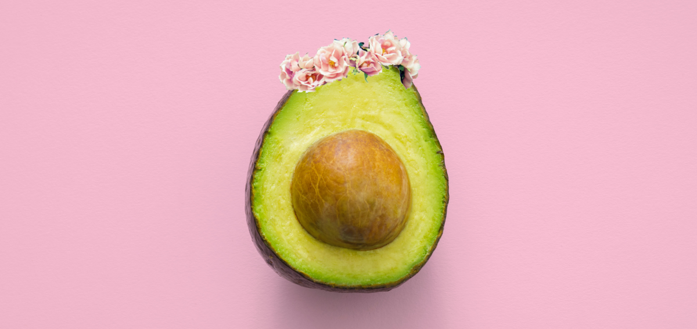

# King Aguacate

> Data Analysis of Justin Kiggins' kaggle ["Avocado Prices"](https://www.kaggle.com/neuromusic/avocado-prices).



## Meet the Team

 |  |  | 
-- | -- | -- | --
Francisco | Nitu | Annie | Jovani

## Conda Environment

Included in our repository is our "environment.yml" With this file in the repository, you can create the new environment by running:

```
conda env create
source activate king-avocado
```

## Project Overview

?

## Todo Checklist

A helpful checklist to gauge how your README is coming on what I would like to finish:

- [ ] Project Overview

## Contributing

Pull requests are welcome. For major changes, please open an issue first to discuss what you would like to change.

Please make sure to update tests as appropriate.

## License

[MIT](https://choosealicense.com/licenses/mit/)
